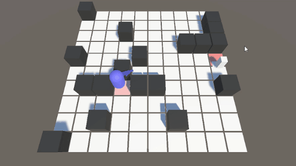

## [0.0.3-alpha] - 2024-07-14
### Added
- 음향 효과(LivingEntity, Gun)
- 게임 오버 UI, 일시정지  
   
Escape로 일시 정지, 사망 시 R로 씬 리로드
- MapGenerator.cs    
<br>
타일 개수, 장애물 퍼센테이지, 타일 사이즈 설정 가능<br>
  
기본적으로 적은 랜덤 타일을 가져와서 생성하나, 플레이어가 일정 시간동안 움직인 거리가 작다면, 플레이어의 위치에서 적 생성(캠핑 방지).


## 

## Todo && Questions
- Damage UI  
  
현재 데미지는 TMP 3D floating Object를 활용해서 띄우고 있는데, 이러한 방법은 문제가 있습니다. 텍스트가 카메라의 위치에 따라 보이는 모양이 다르고(Perspective라?) 다른 오브젝트 사이에 위치되기라도 한다면 데미지가 가려집니다.(UI라면 Sorting Layer를 사용하겠으나 floating text는 효과 없는 것 같아요)<br>
카메라 시점에서 평면으로 보이게 하기 위해 회전을 시켰지만 근본적인 해결은 되지 못하는 것 같습니다. 애니메이팅을 위해 z축으로 이동시킬 때 로컬 좌표계를 써서 그런지 의도하지 않은 방향으로 움직이고, 카메라가 움직이기라도 한다면 이런 방법은 통하지 않을 것 같습니다. <br>
<br>
이런 형태로 카메라에 평면으로 보이고(빌보드처럼) 카메라의 움직임과 오브젝트를 따라가게 하려면 어떻게 하는 게 좋을까요?

- Game Manager<br>
보통 게임에는 GameManager라는 정적 오브젝트가 있던데, 이 게임메니저에서는 보통 어떤 정보를 저장하는 게 좋나요? 가령 현재 ESC로 일시정지 메뉴에 들어가면 timeScale을 0으로 줄여서 오브젝트가 업데이트되는 것을 막지만, Player의 인풋은 막지 못합니다(마우스 커서를 바라보기, 클릭으로 발사하기). 이런 의도치 않은 동작을 막기 위해 GameManager에서 IsPaused 등의 bool 필드를 추적하고 Player에서 GameManager.IsPaused로 제한하는 것이 바람직할까요?<br>
- 디버그 월드와 씬 전환  <br>
  
텔레포터로 진입 시 다른 씬(디버그 씬)으로 전환할 수 있습니다. 플레이어를 그대로 옮기기 위해서 DontDestroyOnLoad를 사용했는데, 처음 씬으로 돌아오면 Player가 또 생깁니다. 이걸 어떻게 해결해야 할까요? GameManager 등을 사용해서 플레이어를 추적하고, 2개 이상의 플레이어가 있다면 생성하지 않음.. 이런 방법을 써야 할까요?

- 효과음 재생<br>
현재 LivingEntity의 피격음을 AudioSource.PlayClipAtPoint(line 42)으로 재생하고 있습니다. 이유는 LivingEntity가 피격 시 죽을 경우 파괴되는데, 이 경우 audioSauce.PlayOneShot(onHitSound)으로 재생하면 재생이 끊기더라고요. 이 경우 어떻게 해야 할까요? 베스트는 LivingEntity를 사망 시 즉시 파괴하는 게 아니라 딜레이를 두고 파괴하는 것 같은데.. SetActive를 끄면 똑같이 소리는 재생되지 않더라고요.<br>
~~또한, 연사 무기의 경우 효과음을 어떻게 해야 할 지 궁금합니다. 단발 효과음을 audiosource.Play()로 빠르게 재생하면 효과음이 끊겨서 어색하고, 그렇다고 PlayOneShot()을 쓰면 이전 효과음이 계속 재생돼서 어색합니다. 어떻게 해야 끊기지 않고 자연스럽게 효과음을 재생해야 할까요?<br>
<br>
  총기 발사 시 짧은 총기 재생음을 OneShot으로 재생하고, 발사 후 짧은 시간 동안 다시 발사하지 않으면 사격 후의 소리를 재생()..음..~~

- Gun.cs<br>
여러 총 만들고, 접촉 시 현재 장착된 총과 교체하기
업그레이드 모듈 추가하기(스테이지를 깰 시 업그레이드가 랜덤으로 주어지고, 그 중 하나 선택)


## [0.0.2-alpha] - 2024-07-11

### Added

### Changed

- IDamageable <br>
기존의 TakeHit 메소드는 RaycastHit을 요구합니다. 적이 근접 공격을 하는 등 RayCast가 필요하지 않을 경우에 필요한 TakeDamage(int damage)를 추가했습니다.
- Projectile.cs  
적 내부에서 발사체가 생성될 경우 적을 그냥 뚫고 지나갑니다. 이를 오브젝트 생성 시 OverlapSphere를 사용해 충돌을 먼저 감지합니다.

- Projectile.cs  
.gif)
타깃을 추적할 수 있습니다. IsHoming으로 활성화/비활성화가 가능합니다.


### TODO, Questions


## [0.0.1-alpha] - 2024-06-29


### Added
- Spawner.cs <br>
웨이브 정보(적 개수, 소환 간격)를 유니티 인스펙터 내에 저장. 

- LivingEntity.cs <br>
모든 생명체는 LivingEntity를 상속합니다.(Player, Enemy)
생명력을 가지게 되며, 0 이하로 떨어지면 죽습니다.
데미지를 입을 수 있는 IDamageable 인터페이스를 상속합니다.

- EnemyRanged.cs<br>
.gif) <br>
Enemy.cs 를 상속합니다. 원거리에서 총으로 공격합니다.


### Changed

- Enemy.cs<br>
.gif)<br>
이제 플레이어를 공격합니다. 플레이어 콜라이더와 충돌했을 경우에만 데미지를 가하고, 충돌하지 않았을 경우(공격이 빗맞았을 경우) 데미지를 주지 않습니다.

- Projectile.cs <br>
 Raycast를 이용해 충돌을 판정, 데미지를 받을 수 있는 오브젝트일 경우 데미지를 줍니다. 충돌할 수 있는 오브젝트라면 오브젝트에 박힙니다. 일정 시간 후 자동 파괴됩니다.


### TODOs, Questions

- parent에 종속된 scale <br>
.png) <br>
.png) <br>
scale (0.1, 0.1, 0.5)의 projectile을 scale (1,3,7)인 오브젝트의 부모로 설정할 경우 오브젝트가 찌그러지는 현상.
tranform.SetParent(object, false)를 사용해도 해결 x
부모 오브젝트의 스케일만큼 곱해졌으니 그 역수를 다시 곱하면 되지 않을까 해서 곱했지만 해결 x

``` cs
        
        transform.localScale = Vector3.Scale(transform.localScale, Utilities.GetReciprocalVector(hit.transform.localScale));
       
```
구글링을 많이 해봤는데도 해결법을 모르겠네요. 어떻게 해야 할까요?

- Enemy vs EnemyRanged <br>
Enemy 함수 내에서 Enum으로 Range, Melee 등으로 표기하고 한 클래스 내에서 관리하는게 나을지, Enemy를 상속하는 EnemyMelee, EnemyRanged 클래스를 따로 만들어서 관리하는게 편할 지 모르겠네요. 만약 Range 적의 원거리 무기의 총알이 떨어졌을 경우 Melee로 전환하는 기능을 넣고 싶다 하면 전자가 맞을 것 같고... 그게 아니면 후자로 따로 상속시키는게 맞는 지 판단이 잘 안갑니다. 후자로 상속한다 해도 대부분의 메서드들은 다 재정의해서 다시 짜야 될 것 같은데 그러면 한 클래스로 관리하는게 맞는지 잘 모르겠네요. 이럴 땐 어떻게 해야 할까요?

- 프로퍼티 vs SetValue() <br>
Projectile.cs에는 damage, velocity 변수가 있습니다.
둘 다 private이지만 velocity는 public SetVelocity()로 외부에서 접근(Gun에서 Instantiate 시 사용)하고, damage는 Damage 프로퍼티로 관리하고 있죠.
둘 다 똑같은 기능 같은데, 어떤 방법이 권장되나요?

- 오브젝트 관리: 그래픽 분리? <br>
첫 번째 질문에서 오브젝트의 스케일이 달라서 parent 시 localscale이 이상해지는 현상이 있어서 그래픽 부분을 따로 분리하는 방법에 대해서 여쭈어 보고 싶습니다.
예를 들어 Medkit 오브젝트의 콜라이더에 닿을 경우 닿은 대상의 체력을 회복합니다.
유니티에서 복잡한 모델을 다룬 적이 없어서 잘 모르겠는데, 이 경우 빈 오브젝트에 콜라이더와 스크립트를 넣고 이 오브젝트의 자식으로 그래픽 오브젝트(콜라이더는 따로 없음)를 넣으면 될까요?
